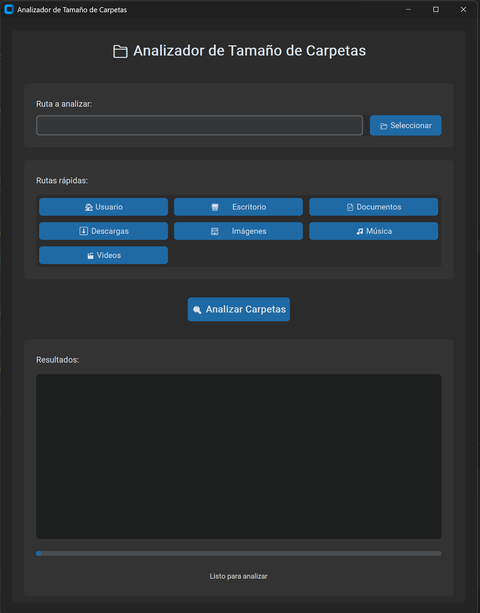

# 📁 Analizador de Tamaño de Carpetas

Una herramienta moderna en Python para analizar y mostrar el tamaño de las carpetas en tu sistema de archivos, con interfaz gráfica elegante y modo línea de comandos.



*Interfaz gráfica moderna con tema oscuro y funcionalidades intuitivas*

## 🚀 Características

- **Interfaz gráfica moderna**: Interfaz elegante con CustomTkinter y tema oscuro
- **Análisis completo**: Calcula el tamaño total de cada carpeta incluyendo todos los archivos y subcarpetas
- **Unidades legibles**: Muestra los tamaños en unidades apropiadas (B, KB, MB, GB, TB)
- **Ordenamiento inteligente**: Las carpetas se muestran ordenadas por tamaño (de mayor a menor)
- **Manejo robusto de errores**: Gestiona permisos, archivos inaccesibles y rutas inexistentes
- **Flexibilidad**: Permite especificar cualquier ruta o usar rutas rápidas predefinidas
- **Arquitectura modular**: Código organizado en módulos separados para mejor mantenimiento
- **Doble modo**: Interfaz gráfica y línea de comandos
- **Barra de progreso**: Visualización del progreso del análisis
- **Rutas rápidas**: Botones para acceder rápidamente a carpetas comunes del sistema

## 📋 Requisitos

- Python 3.7 o superior
- Sistema operativo: Windows, macOS, o Linux
- Dependencias: CustomTkinter, Pillow

## 🛠️ Instalación

1. **Clona o descarga el proyecto**:
   ```bash
   git clone <url-del-repositorio>
   cd analizarTamanioCarpetas
   ```

2. **Instala las dependencias**:
   ```bash
   pip install -r requirements.txt
   ```

## 📖 Uso

### Interfaz gráfica (recomendado)
```bash
python src/main.py
```
o
```bash
python src/main.py --gui
```

### Modo línea de comandos
```bash
python src/main.py --cli "C:\Users\paco_\Documents"
```
o
```bash
python src/main.py "C:\Users\paco_\Documents"
```

### Mostrar ayuda
```bash
python src/main.py --help
```

## 🖥️ Interfaz gráfica

La interfaz gráfica incluye:

- **Selector de carpeta**: Campo de texto y botón para seleccionar la carpeta a analizar
- **Rutas rápidas**: Botones para acceder rápidamente a carpetas comunes:
  - 🏠 Usuario
  - 🖥️ Escritorio
  - 📄 Documentos
  - ⬇️ Descargas
  - 🖼️ Imágenes
  - 🎵 Música
  - 🎬 Videos
- **Barra de progreso**: Muestra el progreso del análisis
- **Área de resultados**: Muestra los resultados formateados
- **Estado en tiempo real**: Información sobre el proceso actual

### Características de la interfaz:
- **Tema oscuro**: Interfaz moderna y fácil para los ojos
- **Responsiva**: Se adapta al tamaño de la ventana
- **No bloqueante**: El análisis se ejecuta en un hilo separado
- **Validación**: Verifica que las rutas existan antes de analizar

## 📊 Ejemplo de salida

### Interfaz gráfica:
La interfaz muestra los resultados en un área de texto formateada con:
- Ruta analizada
- Fecha y hora del análisis
- Lista ordenada de carpetas con sus tamaños
- Total del espacio utilizado

### Línea de comandos:
```
=== ANALIZADOR DE TAMAÑO DE CARPETAS ===

Analizando carpetas en: C:\Users\paco_
------------------------------------------------------------
Calculando tamaño de: Downloads...
Calculando tamaño de: Documents...
Calculando tamaño de: Pictures...
Calculando tamaño de: Desktop...

============================================================
RESULTADOS DEL ANÁLISIS
============================================================
 1. Downloads                          2.45 GB
 2. Documents                          1.23 GB
 3. Pictures                           856.32 MB
 4. Desktop                            234.56 MB
------------------------------------------------------------
TOTAL:                                   4.78 GB
```

## 🏗️ Estructura del proyecto

```
analizarTamanioCarpetas/
├── src/
│   ├── main.py              # Punto de entrada principal
│   ├── gui_interface.py     # Interfaz gráfica
│   └── functions/
│       ├── __init__.py      # Hace que functions sea un módulo
│       └── analizador_functions.py  # Funciones del analizador
├── requirements.txt         # Dependencias del proyecto
└── README.md               # Este archivo
```

## 🔧 Funciones principales

### `obtener_tamaño_carpeta(ruta)` (en `functions/analizador_functions.py`)
Calcula el tamaño total de una carpeta en bytes, incluyendo todos los archivos y subcarpetas.

### `convertir_tamaño(tamaño_bytes)` (en `functions/analizador_functions.py`)
Convierte bytes a una unidad más legible (B, KB, MB, GB, TB).

### `analizar_carpetas(ruta_base)` (en `functions/analizador_functions.py`)
Analiza todas las carpetas en la ruta base y muestra su tamaño ordenado.

### `AnalizadorGUI` (en `src/gui_interface.py`)
Clase principal de la interfaz gráfica que maneja toda la interacción con el usuario.

## ⚠️ Consideraciones

- **Permisos**: El script necesita permisos de lectura en las carpetas que analiza
- **Tiempo de ejecución**: El análisis puede tomar tiempo en carpetas con muchos archivos
- **Memoria**: Para carpetas muy grandes, el script puede consumir memoria significativa
- **Dependencias**: Requiere CustomTkinter para la interfaz gráfica

## 🐛 Solución de problemas

### Error: "No se pudo importar la interfaz gráfica"
- Instala las dependencias: `pip install -r requirements.txt`
- Verifica que tienes Python 3.7 o superior

### Error: "No tienes permisos para acceder"
- Ejecuta el script como administrador
- Verifica que tienes permisos de lectura en la carpeta

### Error: "La ruta no existe"
- Verifica que la ruta especificada sea correcta
- Asegúrate de usar comillas si la ruta contiene espacios

### El script se ejecuta muy lento
- Esto es normal para carpetas con muchos archivos
- Considera analizar subcarpetas específicas en lugar de carpetas muy grandes

### Error de importación de módulos
- Asegúrate de ejecutar el script desde la raíz del proyecto
- Verifica que la estructura de carpetas sea correcta

## 🤝 Contribuciones

Las contribuciones son bienvenidas. Para contribuir:

1. Haz un fork del proyecto
2. Crea una rama para tu feature (`git checkout -b feature/AmazingFeature`)
3. Commit tus cambios (`git commit -m 'Add some AmazingFeature'`)
4. Push a la rama (`git push origin feature/AmazingFeature`)
5. Abre un Pull Request

## 📝 Licencia

Este proyecto está bajo la Licencia MIT. Ver el archivo `LICENSE` para más detalles.

## 👨‍💻 Autor

**Paco** - Francisco Romero

---

⭐ Si este proyecto te ha sido útil, ¡dale una estrella!
